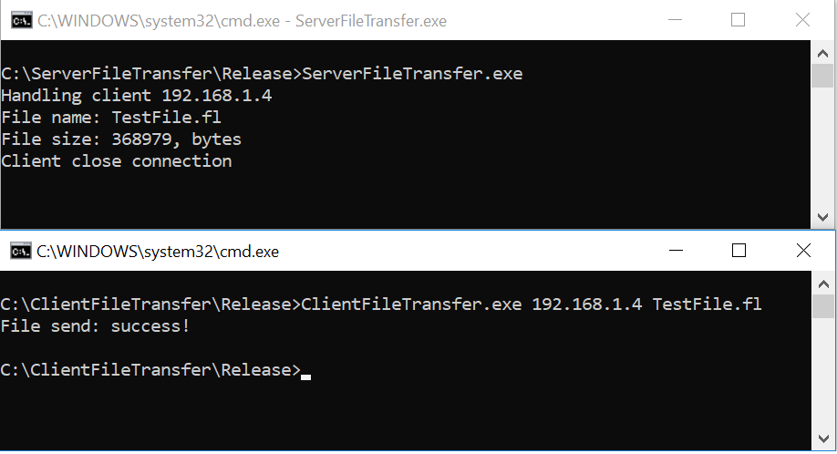
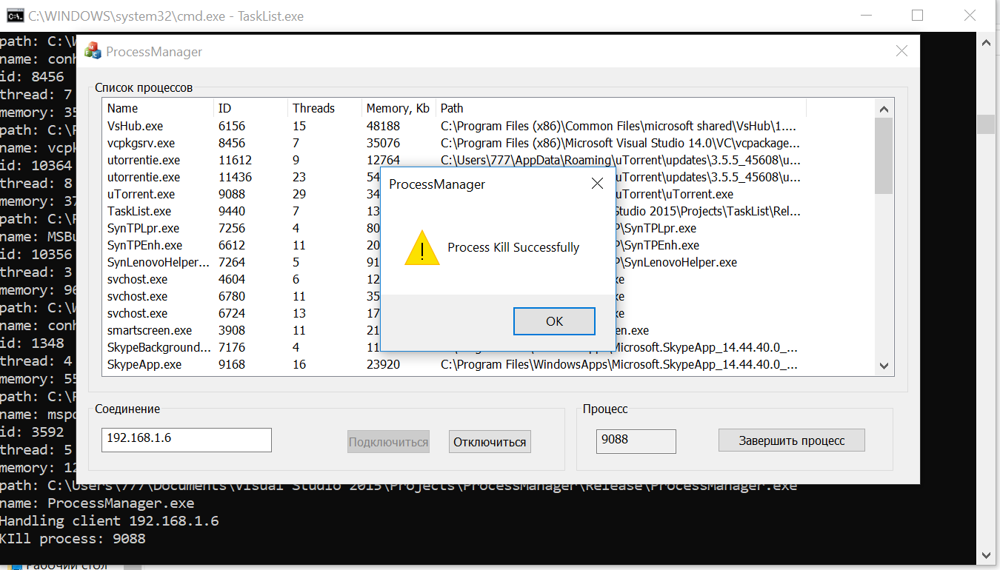

# Результаты тестовых заданий на соискание вакансии middle С++ разработчика.

Реализация двух программ под Windows OC.
 *Жаль, что тестовые задания не покрывают особенностей разработки в Linux и POSIX стандарта*

## 2. TCP File Transfer

Пример использования:

> ConsoleClient.exe 192.168.1.6 filename.type

## 3. ProcessManager

Пример использования:

